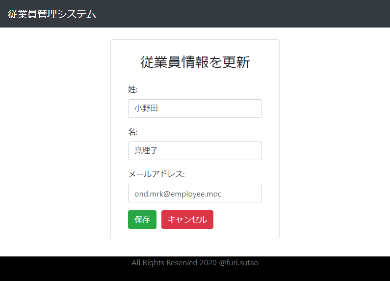

## Spring Boot + React JS シンプル従業員管理システム  
単純な CRUD のみの従業員管理システム（バリデーション、確認ダイアログなどを含まない）。

バックエンド： Spring Boot REST API サーバ
データベース： MySQL 8.0
フロントエンド： React JS

### 利用手順
まずはバックエンドサーバに移動する。
```console
cd ./springboot-backend
```

#### バックエンドサーバを起動
```console
gradle bootRun
```

Gradle をインストールしていない場合は、
```console
./gradlew bootRun
```

エラーなくサーバを起動できたら、フロントエンドサーバに移動する。
```console
cd ./react-frontend
```

#### フロントエンドサーバ

##### Node モジュールをインストール
```console
yarn install
```

##### フロントサーバを起動
```console
yarn start
```

##### ブラウザで確認
```
http://localhost:3000
```

ホーム画面・従業員一覧画面  
http://localhost:3000  
http://localhost:3000/employees


従業員追加画面  
http://localhost:3000/create-add-employee/_add


従業員更新画面  
http://localhost:3000/create-add-employee/:id


従業員詳細画面  
http://localhost:3000/view-employee/:id

